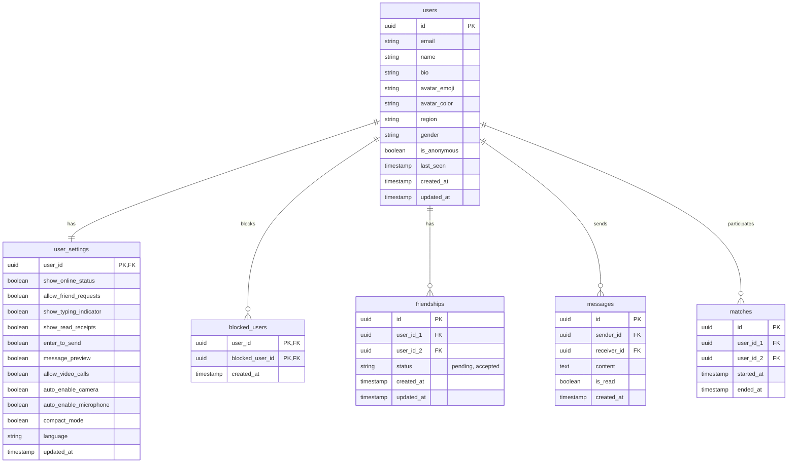

# Database Schema for Whispa

This document outlines the database schema required to support the Whispa application, including user profiles, settings, and social features.

## Entity Relationship Diagram



## SQL Definition (Supabase / PostgreSQL)

```sql
-- Enable UUID extension
create extension if not exists "uuid-ossp";

-- Users Table
create table public.users (
  id uuid references auth.users not null primary key,
  email text unique,
  name text not null,
  bio text,
  avatar_emoji text not null default '🙂',
  avatar_color text not null default 'bg-blue-500',
  region text,
  gender text check (gender in ('male', 'female', 'rather-not-say')),
  is_anonymous boolean default false,
  last_seen timestamp with time zone default now(),
  created_at timestamp with time zone default now(),
  updated_at timestamp with time zone default now()
);

-- User Settings Table
create table public.user_settings (
  user_id uuid references public.users(id) on delete cascade primary key,
  show_online_status boolean default true,
  allow_friend_requests boolean default true,
  show_typing_indicator boolean default true,
  show_read_receipts boolean default true,
  enter_to_send boolean default true,
  message_preview boolean default true,
  allow_video_calls boolean default true,
  auto_enable_camera boolean default false,
  auto_enable_microphone boolean default true,
  compact_mode boolean default false,
  language text default 'English',
  updated_at timestamp with time zone default now()
);

-- Blocked Users Table
create table public.blocked_users (
  user_id uuid references public.users(id) on delete cascade,
  blocked_user_id uuid references public.users(id) on delete cascade,
  created_at timestamp with time zone default now(),
  primary key (user_id, blocked_user_id)
);

-- Friendships Table
create table public.friendships (
  id uuid default uuid_generate_v4() primary key,
  user_id_1 uuid references public.users(id) on delete cascade,
  user_id_2 uuid references public.users(id) on delete cascade,
  status text check (status in ('pending', 'accepted')) default 'pending',
  created_at timestamp with time zone default now(),
  updated_at timestamp with time zone default now(),
  unique(user_id_1, user_id_2)
);

-- Messages Table
create table public.messages (
  id uuid default uuid_generate_v4() primary key,
  sender_id uuid references public.users(id) on delete cascade,
  receiver_id uuid references public.users(id) on delete cascade,
  content text not null,
  is_read boolean default false,
  created_at timestamp with time zone default now()
);

-- Matches Table (History)
create table public.matches (
  id uuid default uuid_generate_v4() primary key,
  user_id_1 uuid references public.users(id) on delete cascade,
  user_id_2 uuid references public.users(id) on delete cascade,
  started_at timestamp with time zone default now(),
  ended_at timestamp with time zone
);

-- Row Level Security (RLS) Policies should be enabled for all tables
alter table public.users enable row level security;
alter table public.user_settings enable row level security;
alter table public.blocked_users enable row level security;
alter table public.friendships enable row level security;
alter table public.messages enable row level security;
alter table public.matches enable row level security;
```

## Implementation Notes

1.  **Avatars**: We strictly use `avatar_emoji` and `avatar_color` columns. No image uploads are supported.
2.  **Persistence**: The `user_settings` table ensures that user preferences are persisted across sessions and devices.
3.  **Real-time**: Supabase Realtime can be enabled for `messages` and `friendships` to support instant updates.
